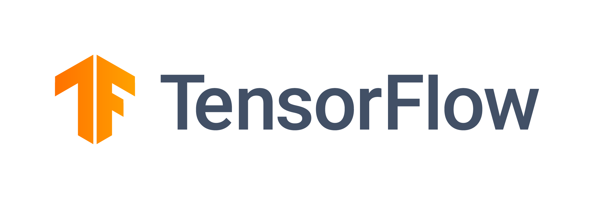

# TensorFlow Tutorials

TensorFlow is an open-source deep learning library, managing data flow graphs, is the most prevalent python library. It helps to generate large-scale neural network with many layers.

### Sequential API
Enables you to generate models layer-by-layer for most top queries. It's regulated because it does not allow you to design models that share layers or have added inputs or outputs.

### Functional API
Able to design models that produce a lot more versatility. Can able to combine layers with several other layers.
